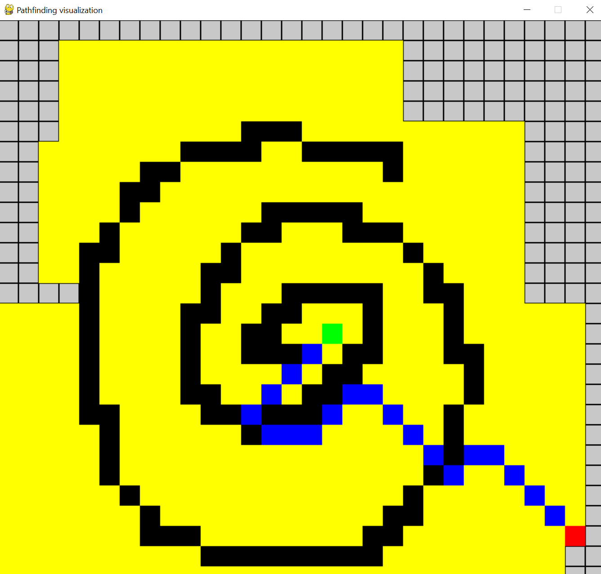
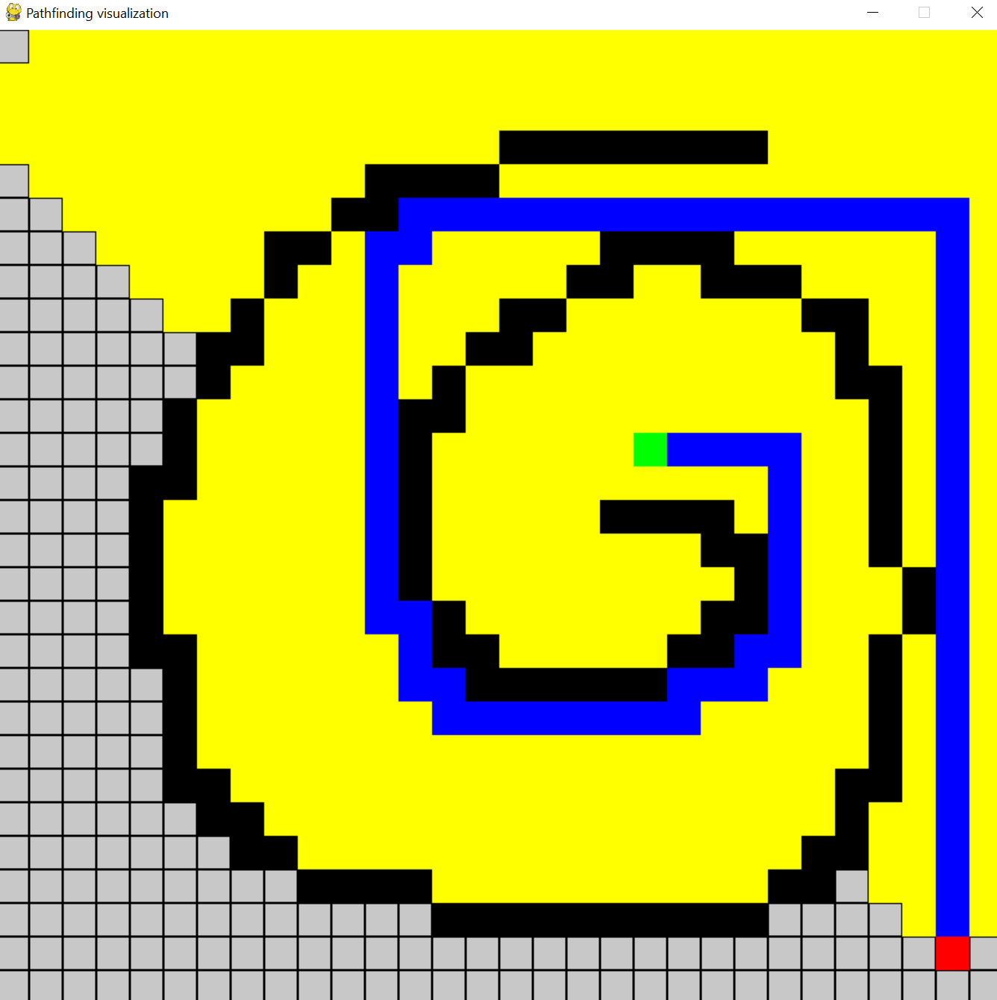

# pathfindingVisualization
Using pygame to create a grid with start/end/border blocks and visualize pathfinding algorithms.

## Goal
* learning about the pygame module and refresh python basics
* implement breadth first search as pathfinding algorithm (you can easily add other pathfinding algorithms to ```code/Pathfinding.py```)

## Run the code
* ```python3 code/Pathfinding.py```
* blocks which are visited by breadth first search are colored yellow
* if there is a path from start to end block, it is colored blue

## Further information
* ```code/Window.py``` creates a pygame window with a grid and allows you to draw different kinds of blocks:
    1. start block (mouse wheel click, green)
    2. end block (right click, red)
    3. border blocks (hold left mouse key, black)
* ```code/Pathfinding.py``` implements the pathfinding part 
    * (to adjust window size and enable/disable diagonal routes, adjust the ```main()``` method at the bottom of the file)
* ```code/Queue.py``` creates a simple queue for the breadth first search

## Images
* __diagonal path enabled:__ 
* __diagonal path disabled:__ 
